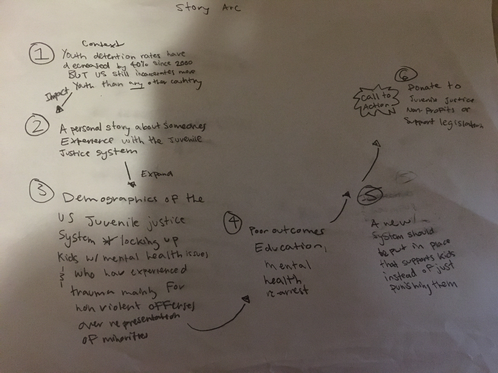

## Final Project Part 1

## Outline

**Summary**
For my final project, I am focusing on the state of the US juvenile justice system. I want to show that although juvenile detention rates have declined dramatically, the US still incarcerates more children than any other country. I will highlight how the juvenile justice system disproportionally impacts minority youth, is mainly concentrated in non-violent offense and perpetuates the challenges children who are already at a disadvantage face. Many states have already implemented laws to improve their juvenile justice systems and hopefully more awareness around the current state of the system will generate support for future initiatives.

Quick Summary - The US is locking up disadvantaged children, mainly for non-violent crimes, and is providing little in the way of support. US kids deserve more than the current juvenile justice system.    

**Project Structure**

I imagine my project starting with a broad perspective. I will start that although juvenile detention rates have declined, the US still remains the country that incarcerates the most youth. I will then put a personal face on the juvenile justice system by telling the story of someone who went through the system and how they ended up in detention. From there, I will expand the focus to look at demographic trends of the juvenile justice system and try to show who is being incarcerated and why. I will follow with data about the outcome and experiences of children who are in juvenile detention centers. This should support the idea that detention and only punitive measures are not an effective way to combat juvenile crime/behavioral problems. I will end with a call to action to support organizations that advocate for the rights of incarcerated youth and legislation that aims to improve the juvenile justice system. 

**User Stories**

As a reader I want juvenile detention to be used sparingly and only for the most violent offenses so kids will not face limited opportunities. 
As a reader I want kids to have access to education and the support they need so they can have better outcomes. 

## Initial Sketches

## Data

The bulk of my data is publicly available. Most of my data is from the statistical briefing book of the Office of Juvenile Justice and Delinquency Prevention (https://www.ojjdp.gov/ojstatbb/). I will be using this source for data about arrest, court case, detention and re-arrest rates for US youth. For these measures, I have access to demographic information such as race and gender. For youths in detention, I will look at additional demographic information like data around health, such as exposure to family violence. I will also use this source for information about the facilities themselves like what mental health and educational services they offer. Lastly, I will use data found in an article in the New Thinking in Community Corrections Bulletin for data about international juvenile detention rates.

https://github.com/mkresnick11/dataviz2/blob/master/Telling%20Stories%20with%20Data%20Final%20Project.xlsx

## Method and Medium

My next step for my final project is to do a more in-depth analysis of the data I’ve found. I’m lucky that there is a lot of publicly available data for my project, so I’ll need to go through the data and see what is most relevant and informative. A more thorough analysis of the data will help me figure out what trends stand out in the data and what aspects of the data I should highlight. This will also give a more exact idea about what sorts of visualizations will be best for my project. 

I’ll use data visualization tools like tableau, datawrapper and rawgraphs to make my visualizations. I’ll also rely on user feedback as I make and rework my visualizations. For my final deliverable, I’ll use shorthand so I can create a narrative with my data visualizations. 

I’ll also do more qualitative research to give my projects additional dimensions. I’ll look for personal stories about experiences with the juvenile justice system, which will hopefully add another more emotional layer to my project. I also want to better understand what non-profit organizations supports this issue and what current legislation looks like for this issue.  

