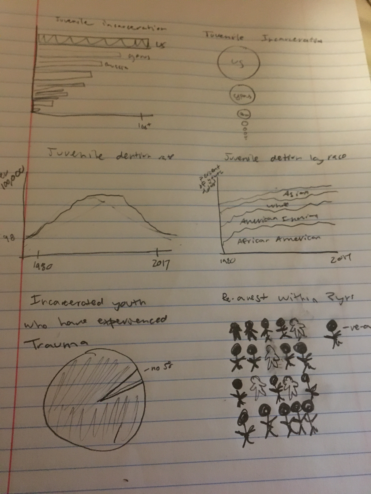

## Final Project Part 1

## Outline

**Summary**

For my final project, I am focusing on the state of the US juvenile justice system. I want to show that although juvenile detention rates have declined dramatically, the US still incarcerates more children than any other country. I will highlight how the juvenile justice system disproportionally impacts minority youth, is mainly concentrated in non-violent offenses and perpetuates the challenges children who are already at a disadvantage face. Many states have already implemented laws to improve their juvenile justice systems and hopefully more awareness around the current state of the system will generate support for future initiatives.

Quick Summary - The US is locking up disadvantaged children, mainly for non-violent crimes, and is providing little in the way of support. US kids deserve more than the current juvenile justice system.    

**Project Structure**

I imagine my project starting with a broad perspective. I will state that although juvenile detention rates have declined, the US still remains the country that incarcerates the most youth. I will then put a personal face on the juvenile justice system by telling the story of someone who went through the system and how they ended up in detention. From there, I will expand the focus to look at demographic trends of the juvenile justice system and try to show who is being incarcerated and why. I will follow with data about the outcome and experiences of children who are in juvenile detention centers. This should support the idea that detention and only punitive measures are not an effective way to combat juvenile crime/behavioral problems. I will end with a call to action to support organizations that advocate for the rights of incarcerated youth and legislation that aims to improve the juvenile justice system. 

**User Stories**

As a reader I want juvenile detention to be used sparingly and only for the most violent offenses so kids will not face limited opportunities. 

As a reader I want kids to have access to education and the support they need so they can have better outcomes. 

## Initial Sketches

For these sketches I focused on what has stood out to me in the data so far: the US being a global leader in youth incarceration, the significant decrease of incarcerated youth, the over representation of minorities in the juvenile justice system, the large amount of incarcerated youth that have experienced trauma and high rates of re-arrest. I thought most about how to make these points standout in visual form when I was sketching.  

## Data

I will be using a lot of data from the statistical briefing book of the Office of Juvenile Justice and Delinquency Prevention (https://www.ojjdp.gov/ojstatbb/). This site offers a massive amount of publically available data about arrest rate, court cases, and detention rates for US youth. For these measures, I also have access to demographic information such as race and gender and the type of office. This source also offers information about detention facilities themselves, such as types of educational and mental health services that are available. Although OJJDP, has tons of data, I thought it was interesting how they had little to no data about youth outcomes who had been detained or about measures of success that placement facilities could use to evaluate themselves. For information of this type, I found data within research studies and reports from non-profits.  

1. No Place For Kids. The Annie E. Casey Foundation. (2014). https://www.aecf.org/resources/no-place-for-kids-full-report/
This report has data around re-arrest rates, mental health of incarcerated, educational outcomes, better models, financial costs and treatment within detention centers.

2. The Burns Institute http://data.burnsinstitute.org/#comparison=3&placement=3&races=1,2,3,4,5,6&offenses=5,2,8,1,9,11,10&year=2015&view=table
This source has information about how detention varies by race

3. Leone, Peter and Lewis Weinberg. Addressing the Unmet Educational Needs of Children and Youth in the Juvenile Justice and Child Welfare Systems. Center for Juvenile Justice Reform at Georgetown University. (2012). https://cjjr.georgetown.edu/wp-content/uploads/2015/03/EducationalNeedsofChildrenandYouth_May2010.pdf This report has information about educational level and outcomes of incarcerated youth.

4. Bozik, Robert et al. How Effective Is Correctional Education,and Where Do We Go from Here?. Rand Corporation (2014). https://www.njjn.org/uploads/digital-library/RAND_How-effective-is-correction-education_2014.pdf. More information regarding education.

5. Just Learning. Southern Education Foundation. (2014).https://www.southerneducation.org/wp-content/uploads/2019/02/Just-Learning-Final.pdf. This report has information about education, mental health, financial costs and re-arrest rates.

6. Snapshot - Improving Educational Opportunties for Youth in the Juvenile Justice System. National Juvenile Justice Network. (2016). https://www.njjn.org/uploads/digital-library/NJJN_Educational%20Re-entry-snapshot_Mar2016_FINAL.pdfI'll be using this mainly for information about re-arrest rates.

7. Better Solutions for Youth with Mental Health Needs in the Juvenile Justice System. National Center for Mental Health and Juvenile Justice. (2014). https://www.njjn.org/uploads/digital-library/Whitepaper_Mental-Health-and-JJ_January-2014.pdf I'll use this source for information related to mental health.

8. Mental Health Needs and Due Process Rights: Finding the Balance. Models for Change - Systems Reforms for Juvenile Justice (2012). https://www.njjn.org/uploads/digital-library/Innovation_Brief_Mental_Health_Needs_and_Due_Process_Rights_Finding_the_Balance-Models4Change-12.12.pdf. I'll use this for information about Mental Health.

9. Because Kids are Different: Five Opportunities for Reforming the Juvenile Justice System. Models for Change. (2014). https://www.njjn.org/uploads/digitallibrary/Because_Kids_are_Different_Five_Opportunities_for_Reforming_the_Juvenile_Justice_System.pdf Mental health and treatment in detention

10. Handle with Care. Coalition for Juvenile Justice. (2013). http://www.njjn.org/uploads/digital-library/Summary-of-CJJ-report-on-mental-health--Handle-with-Care.pdf. I'll use this source for information about mental health.

11. Getting More for Less. Texas Public Policy Foundation. (2010). https://www.njjn.org/uploads/digital-library/resource_1535.pdf I'll use this source for information about re-arrest rates and costs.

12. Burrell, Sue. The National Child Traumatic Stress Network. Trauma and the Environment of Care in Juvenile Institutions.(2013). Information about mental health.

13. Growing Up Locked Down Youth in Solitary Confinement in Jails and Prisons Across the United States. ACLU and Humans Rightd Watch. (2012). http://www.njjn.org/uploads/digital-library/Growing-Up-Locked-Down--Youth-in-Solitary-Confinement-in-Jails-and-Prisons-Across-the-United-States_HRW-ACLU_10-10-12.pdf I'll use this source for information about treatment while incarcerated.

13.Schiraldi, Vincent & McCarthy, Patrick & Shark, Miriam. The Future of Youth Justice: A Community-Based Alternative to the Youth Prison Model. New Thinking in Community Corrections Bulletin. NCJ 250142.(2016).  https://www.researchgate.net/publication/310607289_The_Future_of_Youth_Justice_A_Community-Based_Alternative_to_the_Youth_Prison_ModelLastly. I'll use this mainly for international rates of youth incarceration.

14.Westall, Sarah. Kids Locked Up in America – Youth Incarceration Rates are 5 to 10 Times Higher than Other Developed Countries https://sarahwestall.com/youth-incarceration/. (2017). I'll use this for information about cost. 

https://github.com/mkresnick11/dataviz2/blob/master/Telling%20Stories%20with%20Data%20Final%20Project.xlsx

## Method and Medium

My next step for my final project is to do a more in-depth analysis of the data I’ve found. I have alot of data from OJJP, so I’ll need to go through the data and see what is most relevant and informative. A more thorough analysis of the data will help me figure out what trends stand out in the data and what aspects of the data I should highlight. I'll also need think more about how data from the research and non-profits reports can complement and expand on the data from OJJP. I also feel like my project is on the broader side at the moment so I'll look into ways of narrowing my scope so I can have a more effective narative. Doing this, will also give a more exact idea about what sorts of visualizations will be best for my project. 

I’ll use data visualization tools like tableau, datawrapper and rawgraphs to make my visualizations. I’ll also rely on user feedback as I make and rework my visualizations. For my final deliverable, I’ll use shorthand so I can create a narrative with my data visualizations. 

I’ll also do more qualitative research to give my projects additional dimensions. I’ll look for personal stories about experiences with the juvenile justice system, which will hopefully add another more emotional layer to my project. I also want to better understand what non-profit organizations supports this issue and what current legislation looks like for this issue.  

