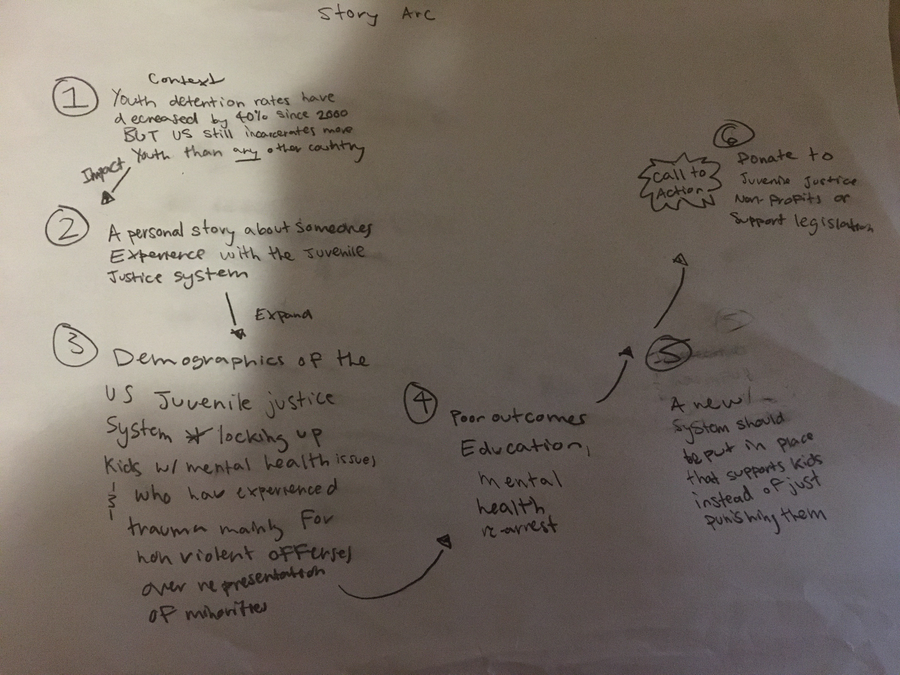
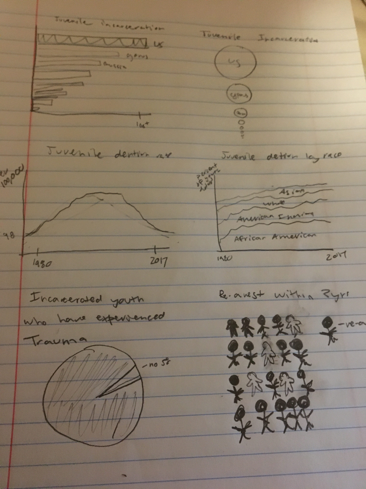

# My Final Project: The US Juvenile Justice System

## Early Thoughts - Final Project Part 1

### Outline

**Summary**

For my final project, I am focusing on the state of the US juvenile justice system. I want to show that although juvenile detention rates have declined dramatically, the US still incarcerates more children than any other country. I will highlight how the juvenile justice system disproportionally impacts minority youth, is mainly concentrated in non-violent offenses and perpetuates the challenges children who are already at a disadvantage face. Many states have already implemented laws to improve their juvenile justice systems and hopefully more awareness around the current state of the system will generate support for future initiatives.

Quick Summary - The US is locking up disadvantaged children, mainly for non-violent crimes, and is providing little in the way of support. US kids deserve more than the current juvenile justice system.    

**Project Structure**

I imagine my project starting with a broad perspective. I will state that although juvenile detention rates have declined, the US still remains the country that incarcerates the most youth. I will then put a personal face on the juvenile justice system by telling the story of someone who went through the system and how they ended up in detention. From there, I will expand the focus to look at demographic trends of the juvenile justice system and try to show who is being incarcerated and why. I will follow with data about the outcome and experiences of children who are in juvenile detention centers. This should support the idea that detention and only punitive measures are not an effective way to combat juvenile crime/behavioral problems. I will end with a call to action to support organizations that advocate for the rights of incarcerated youth and legislation that aims to improve the juvenile justice system. 

**User Stories**

As a reader I want juvenile detention to be used sparingly and only for the most violent offenses so kids will not face limited opportunities. 

As a reader I want kids to have access to education and the support they need so they can have better outcomes. 

# Initial Sketches

For these sketches I focused on what has stood out to me in the data so far: the US being a global leader in youth incarceration, the significant decrease of incarcerated youth, the over representation of minorities in the juvenile justice system, the large amount of incarcerated youth that have experienced trauma and high rates of re-arrest. I thought most about how to make these points standout in visual form when I was sketching.  

# Data

I will be using a lot of data from the statistical briefing book of the Office of Juvenile Justice and Delinquency Prevention (https://www.ojjdp.gov/ojstatbb/). This site offers a massive amount of publically available data about arrest rate, court cases, and detention rates for US youth. For these measures, I also have access to demographic information such as race and gender and the type of office. This source also offers information about detention facilities themselves, such as types of educational and mental health services that are available. Although OJJDP, has tons of data, I thought it was interesting how they had little to no data about youth outcomes who had been detained or about measures of success that placement facilities could use to evaluate themselves. For information of this type, I found data within research studies and reports from non-profits.  

1. No Place For Kids. The Annie E. Casey Foundation. (2014). https://www.aecf.org/resources/no-place-for-kids-full-report/
This report has data around re-arrest rates, mental health of incarcerated, educational outcomes, better models, financial costs and treatment within detention centers.

2. The Burns Institute http://data.burnsinstitute.org/#comparison=3&placement=3&races=1,2,3,4,5,6&offenses=5,2,8,1,9,11,10&year=2015&view=table
This source has information about how detention varies by race

3. Leone, Peter and Lewis Weinberg. Addressing the Unmet Educational Needs of Children and Youth in the Juvenile Justice and Child Welfare Systems. Center for Juvenile Justice Reform at Georgetown University. (2012). https://cjjr.georgetown.edu/wp-content/uploads/2015/03/EducationalNeedsofChildrenandYouth_May2010.pdf This report has information about educational level and outcomes of incarcerated youth.

4. Bozik, Robert et al. How Effective Is Correctional Education,and Where Do We Go from Here?. Rand Corporation (2014). https://www.njjn.org/uploads/digital-library/RAND_How-effective-is-correction-education_2014.pdf. More information regarding education.

5. Just Learning. Southern Education Foundation. (2014).https://www.southerneducation.org/wp-content/uploads/2019/02/Just-Learning-Final.pdf. This report has information about education, mental health, financial costs and re-arrest rates.

6. Snapshot - Improving Educational Opportunties for Youth in the Juvenile Justice System. National Juvenile Justice Network. (2016). https://www.njjn.org/uploads/digital-library/NJJN_Educational%20Re-entry-snapshot_Mar2016_FINAL.pdfI'll be using this mainly for information about re-arrest rates.

7. Better Solutions for Youth with Mental Health Needs in the Juvenile Justice System. National Center for Mental Health and Juvenile Justice. (2014). https://www.njjn.org/uploads/digital-library/Whitepaper_Mental-Health-and-JJ_January-2014.pdf I'll use this source for information related to mental health.

8. Mental Health Needs and Due Process Rights: Finding the Balance. Models for Change - Systems Reforms for Juvenile Justice (2012). https://www.njjn.org/uploads/digital-library/Innovation_Brief_Mental_Health_Needs_and_Due_Process_Rights_Finding_the_Balance-Models4Change-12.12.pdf. I'll use this for information about Mental Health.

9. Because Kids are Different: Five Opportunities for Reforming the Juvenile Justice System. Models for Change. (2014). https://www.njjn.org/uploads/digitallibrary/Because_Kids_are_Different_Five_Opportunities_for_Reforming_the_Juvenile_Justice_System.pdf Mental health and treatment in detention

10. Handle with Care. Coalition for Juvenile Justice. (2013). http://www.njjn.org/uploads/digital-library/Summary-of-CJJ-report-on-mental-health--Handle-with-Care.pdf. I'll use this source for information about mental health.

11. Getting More for Less. Texas Public Policy Foundation. (2010). https://www.njjn.org/uploads/digital-library/resource_1535.pdf I'll use this source for information about re-arrest rates and costs.

12. Burrell, Sue. The National Child Traumatic Stress Network. Trauma and the Environment of Care in Juvenile Institutions.(2013). Information about mental health.

13. Growing Up Locked Down Youth in Solitary Confinement in Jails and Prisons Across the United States. ACLU and Humans Rightd Watch. (2012). http://www.njjn.org/uploads/digital-library/Growing-Up-Locked-Down--Youth-in-Solitary-Confinement-in-Jails-and-Prisons-Across-the-United-States_HRW-ACLU_10-10-12.pdf I'll use this source for information about treatment while incarcerated.

14. Schiraldi, Vincent & McCarthy, Patrick & Shark, Miriam. The Future of Youth Justice: A Community-Based Alternative to the Youth Prison Model. New Thinking in Community Corrections Bulletin. NCJ 250142.(2016).  https://www.researchgate.net/publication/310607289_The_Future_of_Youth_Justice_A_Community-Based_Alternative_to_the_Youth_Prison_ModelLastly. I'll use this mainly for international rates of youth incarceration.

15. Westall, Sarah. Kids Locked Up in America – Youth Incarceration Rates are 5 to 10 Times Higher than Other Developed Countries https://sarahwestall.com/youth-incarceration/. (2017). I'll use this for information about cost. 

https://github.com/mkresnick11/dataviz2/blob/master/Telling%20Stories%20with%20Data%20Final%20Project.xlsx

## Method and Medium

My next step for my final project is to do a more in-depth analysis of the data I’ve found. I have alot of data from OJJP, so I’ll need to go through the data and see what is most relevant and informative. A more thorough analysis of the data will help me figure out what trends stand out in the data and what aspects of the data I should highlight. I'll also need think more about how data from the research and non-profits reports can complement and expand on the data from OJJP. I also feel like my project is on the broader side at the moment so I'll look into ways of narrowing my scope so I can have a more effective narative. Doing this, will also give a more exact idea about what sorts of visualizations will be best for my project. 

I’ll use data visualization tools like tableau, datawrapper and rawgraphs to make my visualizations. I’ll also rely on user feedback as I make and rework my visualizations. For my final deliverable, I’ll use shorthand so I can create a narrative with my data visualizations. 

I’ll also do more qualitative research to give my projects additional dimensions. I’ll look for personal stories about experiences with the juvenile justice system, which will hopefully add another more emotional layer to my project. I also want to better understand what non-profit thoughts on this issue and what current legislation looks like for this issue.

## First Draft - Final Project Part 2

# Wireframes/Storyboard 

[Storyboard](https://github.com/mkresnick11/dataviz2/blob/master/Final%20Project%20Part%202.pdf)

# User Research Protocol

**Audience and Interview Candidate Selection Process** 

I believe my topic has a wide audience. I think it's one that most people will care and be concerned about.  
I understand my audience as anyone who lives in America or even more broadly: anyone who could spread awareness 
about the state of the juvenile justice system. As I think my topic has a wide reach, I believe any individual 
could be a good candidate for me to interview. I’ll do my best to find a wide range of people who vary in
age, program or politics. 

**Interview Script**

Introduction - Hi. My name is Melanie. I’m taking Telling Stories with Data this semester. For my final project, I’ve decided to look at 
the US juvenile justice system. Do you have some time to take a look at the rough draft of my final project and answer a few questions?

1. What is your first reaction to the graph as in what do you think the graph means the first time you see it? (for each visualization) 

2. Does that meaning change when you’ve had more time to look at the visualization? (for each visualization) 

3. What do you think of the organization and structure of the project?

4. Is there anything you found confusing or think needs additional information?

5. What do you think is the main message of the project?

6. Final thoughts? Do you have any additional comments?

**Interviewees**

1. Woman, Late 20's, Heinz Student
2. Woman, early 20's, Heinz Student
3. Man, Late 50's, Retired

**Interview Findings**

**Questions 1 and 2**

Section 1. This graph got a good response in terms of the meaning I wanted to convey. Everyone that I interviewed thought this graph was clear and was able to understand its meaning quickly. I did get comments about the text in section 1, specifically the however. I meant this as a transition and this might not be an issue when my project is in shorthand and someone would be scrolling through the story instead of looking at it page by page. The other comment about the text I got was that I should define what youth means. This is a good comment and I will make sure to define youth as someone who is under 18. I also got a comment that it could be interesting to include other factors on the line graph. For example has the gender breakdown stayed constant over time or has it changed?

Section 2. The people I interviewed were able to understand this graph’s meaning quickly. 

Section 3. This graph’s meaning was clear as well. Although, I did receive comments that its meaning could be more immediately clear. I think I could color more effectively to highlight the point I want to make. 

Section 4. This graph got several comments about how it was confusing. Someone pointed out that the violent offenses were vertical and the non-violent offense were horizontal. I also got another good comment about how the legend was not in the same order as the graph. There were other comments about the readability of this graph, but I hope this will be corrected when the graph is in digital form. I also left out a subtitle for this graph of what the graph is depicting. 

Section 5.1 The people I interviewed thought that the pie charts were clear. For the third graphic, I got a comment that my color legend should reflect the order of the visualization. Again, I need subtitles for these graphs giving more specific information about what they are showing. I also got comments that there is too much text on this page, which is something I will have more control over when I’m working in shorthand. 

Section 5.2 The people I interviewed thought the dot chart was clear and communicated its intending meaning quickly.

Section 6. I got comments that the first graph is lost in the wording and that I should let the bar chart stand out more. I got a good response on the above and below aspect of the bar chart, but I think I might need to think about the units on the y-axis a bit more. Someone pointed out to me that the I had zero between the two 50%s, which was confusing since that is meant to show the average acedemic performance. Also the negative 50% is confusing and isn't what I want to show - which is being below average, not a 50% decrease.  be I did not get comments about how the second visualization (stick figures). I think I’ll need to add more description to this visualization

Section 6.2 People thought the visualizations were clear in this section. I did get several comments about how this section is cluttered and that I could use white space more effectively. I also received a comment that I could potentially use a graphic of a coin toss instead of a pie chart for the first visualization. 

Section 7. Several people found the first graph confusing. The dates looked as if they could possibly be labeling the first three bars instead of showing that they represent different time frames. I also received comments about how the section labels could be moved to the left, in front of the lines to increase readability. The second graph was clear and communicated its meaning quickly. However, an interviewee pointed out that I had labeled the second bar as do not re-enroll. This was a great catch and I’ll definitely review my labels more carefully in the future.   

Section 8. For this graph, I received a question about what re-arrest means. This person also found the wording new convictions confusing. All interviews did not realize that the grey signified a range of values. I’ll need to find a way to make this clearer. One interviewee also mentioned how she wished she saw the rate of re-enrolling in highschool on this graph, especially since I reference this in the chart’s title. However, I do not have data for high school re-enroll rates broken up by within 2 years or 3 years or later.  Maybe I could find another way, though, to incorporate this metric into the graph. Interestingly, all interviews also commented that the label 3 years after release was confusing and that 3 years or later might be a better wording.  

Section 9. All of my interviews found this last section confusing and do not think the extent of the situation was unclear. I definitely explained more to people about this section than any other. I’ll need to find a way to more effectively visually communicate what I want to say.  People also wanted more information about the context and were also curious about how many states did collect this data. They wanted to know more than just how many states used data. Someone also commented that the vertical barchart is not that effective of anway to show the breakdown of how states use data.    

**Question 3**

The people I interviewed were fine with the order and structure of the project. No one had any comments around this topic.

**Question 4**

Everyone mentioned that they wished there was more context in section nine and thought that section could be expanded. 
 
**Question 5**

Two people I interviewed thought the main message of the project was that there are serious issues with the US juvenile justice system. Another person thought the main message of the project was the racial disparities present in the US juvenile justice system. Both are points that I wanted my project to stress. 

**Question 6**

One interviewee mentioned that he wished there was a section on the cost of the juvenile justice system and said that could further emphasize the project’s point. He thought this section could potentially be before the recidivism section. Other final comments were more theoretical about ideas like what it means that this data is in some cases not even being collected. 

 # Revised Wireframes
 
 I still have a lot of work left to do for my visualizations. I'm not sure how to make group symbol charts so I'll need to look into this. I also think a lolipop chart go be effective for certain parts of data, so I'll look into this as well. 
 Also, while I was able to improve my treemap, I could not figure out how to make each section vertical which was a suggestion I got during an interview. I also couldn't figure out how to stack bar charts for my visualizations of educational outcomes while detained. I am pretty happy with the digital version of my first three charts which are below:
 
 
 
 

<noscript></noscript><object class='tableauViz'  style='display:none;'><param name='host_url' 
value='https%3A%2F%2Fpublic.tableau.com%2F' /> <param name='embed_code_version' value='3' /> <param name='site_root' value='' /><param name='name' value='LineChart_15821464835340&#47;Sheet1' /><param name='tabs' value='no' /><param name='toolbar' value='yes' /><param name='static_image' value='https:&#47;&#47;public.tableau.com&#47;static&#47;images&#47;Li&#47;LineChart_15821464835340&#47;Sheet1&#47;1.png' /> <param name='animate_transition' value='yes' 
/><param name='display_static_image' value='yes' /><param name='display_spinner' value='yes' /><param name='display_overlay' value='yes' /><param name='display_count' value='yes' /></object>
 

 
 
 <iframe title="Black Youth are Overrepresented in Juvenile Justice Facilities  " aria-label="Stacked Column Chart" id="datawrapper-chart-V59QT" src="//datawrapper.dwcdn.net/V59QT/1/" scrolling="no" frameborder="0" style="width: 0; min-width: 100% !important; border: none;" height="600"></iframe>

 

<noscript></noscript><object class='tableauViz'  style='display:none;'
><param name='host_url' value='https%3A%2F%2Fpublic.tableau.com%2F' /> <param name='embed_code_version' value='3' 
/> <param name='site_root' value='' /><param name='name' value='Offense_15820718840290&#47;Sheet1' /><param name='tabs' value='no' /><param name='toolbar' value='yes' /><param name='static_image' value='https:&#47;&#47;public.tableau.com&#47;static&#47;images&#47;Of&#47;Offense_15820718840290&#47;Sheet1&#47;1.png' /> <param name='animate_transition' value='yes' /><param name='display_static_image' value='yes' /><param name='display_spinner' value='yes' /><param name='display_overlay' value='yes' /><param name='display_count' value='yes' /></object>
 
 
 
 

<noscript></noscript><object class='tableauViz'  style='display:none;
 '><param name='host_url' value='https%3A%2F%2Fpublic.tableau.com%2F' /> <param name='embed_code_version' value='3' 
 /> <param name='site_root' value='' /><param name='name' value='Ed_15820493661610&#47;Sheet1' /><param name='tabs' value='no' /><param name='toolbar' value='yes' /><param name='static_image' value='https:&#47;&#47;public.tableau.com&#47;static&#47;images&#47;Ed&#47;Ed_15820493661610&#47;Sheet1&#47;1.png' /> <param name='animate_transition' value='yes' 
 /><param name='display_static_image' value='yes' /><param name='display_spinner' value='yes' /><param name='display_overlay' value='yes' /><param name='display_count' value='yes' /></object>
 
 
 
 ## Deliverable, Closing Thoughts and Sources - Final Project Part 3

To see my deliverable:

# Closing Thoughts

**Audience**

My audience has remained much the same since I first started thinking about this project. I still believe that the US juvenile justice system is a national issue that I hope would resonate with all American regardless of region, age or gender etc. I did, though, try to keep the content of my project at a broad, high level to make it as accessible as possible. 

I wanted my project to be readable and easy to understand so that no one would get lost or confused with the information I am presenting. I also did not base my project around a single state or specific juvenile justice system. I really wanted my project to have a national scope, both to show that this is a national issue and to keep as wide an audience as possible.  

**Summary**

A lot of my project involved tracking down data. As my project illustrates it was hard to track down information about the juvenile justice system that did not relate to demographic information about the minors the US is incarcerating. I think it’s really interesting that there is so much demographic information, yet there are not even any requirements for collecting data related to the efficacy of juvenile justice programs. For a system supposedly based on rehabilitation, there is little data in terms of measuring success.  

Another large piece of my project was narrowing the scope. The juvenile justice system is a massive topic that involves far more issues than I could fit into a single project. I left out topics like the school to prison pipeline and information about being charged and either taking a plea or going to court. All of these topics and many more are important and each warrant a project specific to them. I ultimately decided to focus the most on the kids and their experiences inside detention. I did this because it’s one of the topics within the juvenile justice system that I know the least about and I thought others would be less likely to have concrete information on this topic. 

I did think about expanding my topic. One of my interviewees for my wireframes suggested that I could strengthen my project by including data around the price of juvenile detention and recidivism of young offenders. I have this data and it includes incredibly high numbers across most states. However, I really wanted my project to focus on the kids in detention and I did not want the cost of detention to distract the audience from them. 

Much of my design designs revolved around keeping my visualizations simple and clear. I was aiming for the kind of visualizations where their meaning can be understood quickly. Another way I kept my visualization simple was keeping my use of color to a minimum. I only used color when there was something I wanted to stress and tried not to use several different colors on a single visualization. I also tried to keep to a consistent color scheme of blue and red throughout the majority of my project. 

This project helped me focus on being visually precise and viewing a visualization as an experience. In my interviews I received a lot of comments on minor details, such as a legend that was not in the same order as the visualization. I thought about how my audience would experience the image and tried to correct any small details that could cloud the visualization’s meaning.  

I also thought a lot about how information and visualizations work together. I ended up cutting certain visualizations since I felt they did not enhance the text. I had one bar chart I liked that showed that half of students entered juvenile detention academically behind their peers. I had a single red bar going down from 0 to -50%. While the meaning was quickly apparent to most of my interviewees, the chart became confusing if you actually really looked at it. I wasn’t trying to show a percent decrease and 0 does not equate to average academic performance. I tried to make an infographic with this information, something with a bar that would have 50% below it. I ultimately decided that the words were enough on their own and that the data could not be better understood or presented more clearly in a visual form (that I could make). There was also data where I chose to go with an image instead of a graph as I thought this made the meaning clearer. 

Overall, I learned a lot about the US juvenile justice system. This project also made me think more critically about data and the most effective ways to communicate information.

# Sources 

ACLU and Humans Rights Watch. Growing Up Locked Down Youth in Solitary Confinement in Jails and Prisons Across the United States. (2012). http://www.njjn.org/uploads/digital-library/Growing-Up-Locked-Down--Youth-in-Solitary-Confinement-in-Jails-and-Prisons-Across-the-United-States_HRW-ACLU_10-10-12.pdf 

The Annie E. Casey Foundation. No Place for Kids. (2014). https://www.aecf.org/resources/no-place-for-kids-full-report/

McCluskey, Molly. What If This Were Your Kid. The Atlantic. (2017) https://www.theatlantic.com/politics/archive/2017/12/juvenile-solitary-confinement/548933/

Bozik, Robert et al. Rand. How Effective Is Correctional Education, and Where Do We Go from Here?. Rand Corporation (2014). https://www.rand.org/pubs/research_reports/RR564.html

Brown, Emma. Washington Post. Educational Opportunities Lag for Kids in Juvenile Detention, Study Finds (2015).
https://www.washingtonpost.com/news/education/wp/2015/11/05/educational-opportunities-lag-for-kids-in-juvenile-detention-study-finds/

The Burns Institute http://data.burnsinstitute.org/#comparison=3&placement=3&races=1,2,3,4,5,6&offenses=5,2,8,1,9,11,10&year=2015&view=table

Burrell, Sue. The National Child Traumatic Stress Network. Trauma and the Environment of Care in Juvenile Institutions.(2013). https://www.njjn.org/uploads/digital-library/NCTSN_trauma-and-environment-of-juvenile-care-institutions_Sue-Burrell_September-2013.pdf

Complex Trauma Treatment Network of the National Child Traumatic Stress Network. Complex Trauma: In Juvenile Justice System Involved Youth. (2016). Los Angeles, CA, & Durham, NC: National Center for Child Traumatic Stress. https://www.nctsn.org/resources/complex-trauma-juvenile-justice-system-involved-youth

The Council of State Governments Justice Center. Locked Out.  (2015). https://csgjusticecenter.org/wp-content/uploads/2015/11/LOCKED_OUT_Improving_Educational_and_Vocational_Outcomes_for_Incarcerated_Youth.pdf

Keierleber, Max. The 74. The Lost Kids: New Report Exposes Startling Lack of Education Standards at Juvenile Justice Facilities. (2015).
https://www.the74million.org/article/the-lost-kids-new-report-exposes-startling-lack-of-education-standards-at-juvenile-justice-facilities/

Leone, Peter and Lewis Weinberg. Addressing the Unmet Educational Needs of Children and Youth in the Juvenile Justice and Child Welfare Systems. Center for Juvenile Justice Reform at Georgetown University. (2012). https://cjjr.georgetown.edu/wp-content/uploads/2015/03/EducationalNeedsofChildrenandYouth_May2010.pdf .

Models for Change. Because Kids are Different: Five Opportunities for Reforming the Juvenile Justice System. (2014). http://www.modelsforchange.net/publications/718

Models for Change.  Innovation Brief: Mental Health Needs and Due Process Rights: Finding the Balance. - Systems Reforms for Juvenile Justice (2012). http://www.modelsforchange.net/publications/355

MST Services. Do We Know The Full Extent of Juvenile Recidivism? http://info.mstservices.com/blog/juvenile-recidivism-rates

National Center for Mental Health and Juvenile Justice. Better Solutions for Youth with Mental Health Needs in the Juvenile Justice System. (2014). https://www.njjn.org/uploads/digital-library/Whitepaper_Mental-Health-and-JJ_January-2014.pdf 

National Juvenile Justice Network. Snapshot - Improving Educational Opportunities for Youth in the Juvenile Justice System. (2016). https://www.njjn.org/our-work/improving-education-for-youth-in-juvenile-justice-snapshot

The National Child Traumatic Stress Network. https://www.nctsn.org/sites/default/files/resources//victimization_juvenile_offending.pdf#page=4

NDTAC. Fast Facts. https://neglected-delinquent.ed.gov/fast-facts/united-states?subpart=1%20

Office of Juvenile Justice and Delinquency Prevention. https://www.ojjdp.gov/ojstatbb/

Schiraldi, Vincent & McCarthy, Patrick & Shark, Miriam. New Thinking in Community Corrections Bulletin. The Future of Youth Justice: A Community-Based Alternative to the Youth Prison Model. NCJ 250142.(2016).  https://www.researchgate.net/publication/310607289_The_Future_of_Youth_Justice_A_Community-Based_Alternative_to_the_Youth_Prison_ModelLastly.

Southern Education Foundation. Just Learning. (2014).https://www.southerneducation.org/wp-content/uploads/2019/02/Just-Learning-Final.pdf. 

Texas Public Policy Foundation. Getting More for Less. (2010). https://www.njjn.org/uploads/digital-library/resource_1535.pdf 

U.S. Department of Justice. Juvenile Residential Facility Census, 2006: Selected Findings https://www.ncjrs.gov/pdffiles1/ojjdp/228128.pdf

Westall, Sarah. Kids Locked Up in America – Youth Incarceration Rates are 5 to 10 Times Higher than Other Developed Countries https://sarahwestall.com/youth-incarceration/

 
